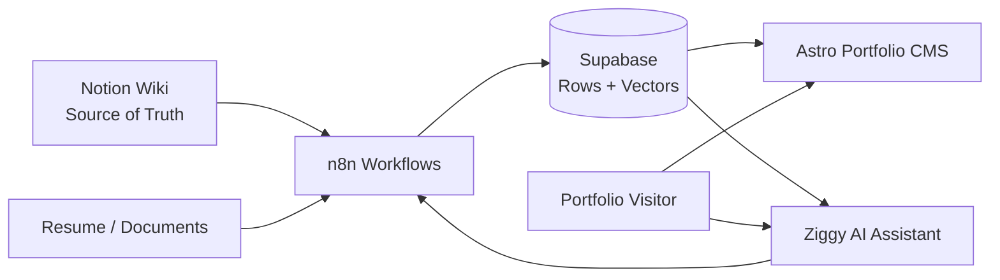

# Autonomous Portfolio CMS

A self-hosted, AI-enhanced portfolio system for Chris Nelson — an IT operations and systems administrator. The system uses Notion as the source of truth for personal and professional information, n8n workflows to transform and synchronize data, Supabase for relational storage, and an Astro SSR portfolio website with an AI chat assistant ("Ziggy").

## Architecture



## Repository Structure

```text
autonomous-portfolio-cms/
├── .github/
│   └── workflows/
│       └── deploy.yml          # GitHub Action: deploy to DigitalOcean (pending migration)
├── CMS/                        # Astro SSR portfolio website
│   ├── src/
│   ├── public/
│   ├── package.json
│   ├── astro.config.mjs
│   ├── tsconfig.json
│   └── README.md               # CMS-specific documentation
├── WORKFLOWS/                  # Sanitized n8n workflow exports
│   ├── skills/
│   ├── certifications/
│   ├── achievements/
│   ├── projects/
│   ├── ziggy/
│   ├── shared/
│   └── README.md               # Workflow documentation & conventions
├── docs/
│   └── deployment.md           # Deployment documentation (current & planned)
├── .gitignore
└── README.md                   # This file
```

## Components

### `CMS/`

The Astro SSR portfolio website. Serves the public-facing portfolio with About, Skills, Certifications, Achievements Feed, and Projects sections. Includes the Ziggy AI chat widget. See [`CMS/README.md`](CMS/README.md) for full documentation.

### `WORKFLOWS/`

Sanitized exports of n8n workflows that synchronize data from Notion to Supabase and power portfolio automation. See [`WORKFLOWS/README.md`](WORKFLOWS/README.md) for workflow conventions and safety guidelines.

### `docs/`

Deployment and operational documentation. See [`docs/deployment.md`](docs/deployment.md) for current and planned deployment models.

### `.github/workflows/`

GitHub Actions CI/CD configuration. The deployment workflow is currently in transition — see [Deployment Status](#current-status-and-roadmap) below.

## Local CMS Development

```bash
cd CMS
npm ci
npm run dev
```

The dev server starts at `http://localhost:4321`.

## Production Build

```bash
cd CMS
npm ci
npm run build
node ./dist/server/entry.mjs
```

Override the default host and port:

```bash
HOST=127.0.0.1 PORT=3000 node ./dist/server/entry.mjs
```

## Environment Variables

The CMS requires environment variables in `CMS/.env` (not committed). See [`CMS/README.md`](CMS/README.md) for the full list:

| Variable                      | Scope       | Description                                      |
| ----------------------------- | ----------- | ------------------------------------------------ |
| `PUBLIC_SUPABASE_URL`         | CMS         | Supabase project URL                             |
| `PUBLIC_SUPABASE_ANON_KEY`    | CMS         | Supabase anon key                                |
| `WEBHOOK_SECRET`              | CMS         | Shared secret for n8n webhook authorization      |
| `N8N_CHAT_WEBHOOK`            | CMS         | n8n webhook URL for Ziggy AI chat proxy          |

GitHub Actions deployment secrets are configured in the repository settings, not in `.env`:

| Secret             | Description                                      |
| ------------------ | ------------------------------------------------ |
| `DROPLET_IP`       | DigitalOcean droplet IP address                  |
| `DROPLET_USER`     | SSH username                                     |
| `SSH_PRIVATE_KEY`  | Private SSH key authorized on the droplet        |

## Security Notes

- `.env` files are gitignored and must never be committed
- n8n credential exports are gitignored — see [`WORKFLOWS/README.md`](WORKFLOWS/README.md)
- Supabase RLS policies restrict access to the `anon` role
- The Ziggy chat widget sanitizes all bot responses with DOM-based XSS filtering
- User input in the chat widget is escaped via `textContent`

## Documentation

- [`CMS/README.md`](CMS/README.md) — Full CMS documentation (features, API, database schema)
- [`WORKFLOWS/README.md`](WORKFLOWS/README.md) — n8n workflow conventions and safety
- [`docs/deployment.md`](docs/deployment.md) — Deployment model (current and planned)

## Current Status and Roadmap

### Completed

- [x] Astro SSR portfolio with Supabase integration
- [x] Skills, Certifications, and Achievements sections
- [x] Ziggy AI chat widget with markdown rendering
- [x] n8n webhook endpoint for achievement posts
- [x] Dark-mode UI with responsive navigation
- [x] Favicon and avatar
- [x] Wiki links (wiki.chris.guru)
- [x] GitHub Actions deployment to DigitalOcean (initial)
- [x] Repository restructured into CMS + WORKFLOWS + docs

### In Progress

- [ ] **Deployment migration** — The GitHub Action (`.github/workflows/deploy.yml`) still references the old deployment process (`/home/chris/deploy.sh`). This is being migrated to a dedicated `deploy` user with restricted permissions. The YAML has intentionally not been updated yet.
- [ ] **Deploy user migration** — A dedicated non-human `deploy` user is planned but not yet created. See [`docs/deployment.md`](docs/deployment.md) for the migration plan.

### Planned

- [ ] Export and commit sanitized n8n workflows
- [ ] Feed pagination / progressive disclosure
- [ ] Authentication & admin middleware for content management
- [ ] Build out the Projects section with detail pages
- [ ] RSS/Atom feed for achievements

## License

MIT
