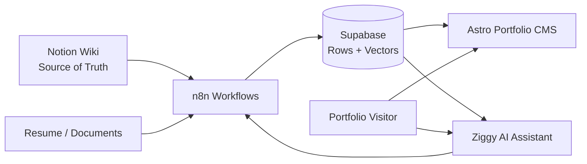

# Autonomous Portfolio CMS

A self-hosted, AI-enhanced portfolio system for Chris Nelson — an IT operations and systems administrator. The system uses Notion as the source of truth for personal and professional information, n8n workflows to transform and synchronize data, Supabase for relational storage, and an Astro SSR portfolio website with an AI chat assistant ("Ziggy").

## Architecture


```mermaid
flowchart LR
    Notion[Notion Wiki<br/>Source of Truth]
    Resume[Resume / Documents]
    N8N[n8n Workflows]
    Supabase[(Supabase<br/>Rows + Vectors)]
    CMS[Astro Portfolio CMS]
    Ziggy[Ziggy AI Assistant]
    Visitor[Portfolio Visitor]

    Notion --> N8N
    Resume --> N8N
    N8N --> Supabase
    Supabase --> CMS
    Supabase --> Ziggy
    Visitor --> CMS
    Visitor --> Ziggy
    Ziggy --> N8N
```

## Repository Structure

```text
autonomous-portfolio-cms/
├── .github/
│   └── workflows/
│       └── deploy.yml          # GitHub Action: deploy to DigitalOcean
├── CMS/                        # Astro SSR portfolio website
│   ├── src/
│   ├── public/
│   ├── package.json
│   ├── astro.config.mjs
│   ├── tsconfig.json
│   └── README.md               # CMS-specific documentation
├── workflows/
│   └── README.md               # Pointer to canonical n8n workflows
├── docs/
│   └── deployment.md           # Deployment documentation (current & planned)
├── .gitignore
└── README.md                   # This file
```

## Components

### `CMS/`

The Astro SSR portfolio website. Serves the public-facing portfolio with About, Skills, Certifications, Achievements Feed, and Projects sections. Includes the Ziggy AI chat widget. See [`CMS/README.md`](CMS/README.md) for full documentation.

### `workflows/`

Architectural pointer to the dedicated
[`n8n-workflows`](https://github.com/christopherjnelson/n8n-workflows/tree/master/chris-guru)
repository, which contains the sanitized exports and setup guides for workflows
that synchronize public portfolio data, maintain the Supabase vector knowledge
base, publish feed updates, and power Ziggy.

### `docs/`

Deployment and operational documentation. See [`docs/deployment.md`](docs/deployment.md) for current and planned deployment models.

### `.github/workflows/`

GitHub Actions CI/CD configuration. The deployment workflow deploys to a DigitalOcean droplet via a dedicated `deploy` user with systemd-managed process — see [Deployment Status](#current-status-and-roadmap) below.

## Local CMS Development

```bash
cd CMS
npm ci
npm run dev
```

The dev server starts at `http://localhost:4321`.

## Production Build

```bash
cd CMS
npm ci
npm run build
node ./dist/server/entry.mjs
```

Override the default host and port:

```bash
HOST=127.0.0.1 PORT=3000 node ./dist/server/entry.mjs
```

## Environment Variables

The CMS requires environment variables in `CMS/.env` (not committed). See [`CMS/README.md`](CMS/README.md) for the full list:

| Variable                      | Scope       | Description                                      |
| ----------------------------- | ----------- | ------------------------------------------------ |
| `PUBLIC_SUPABASE_URL`         | CMS         | Supabase project URL                             |
| `PUBLIC_SUPABASE_ANON_KEY`    | CMS         | Supabase anon key                                |
| `WEBHOOK_SECRET`              | CMS         | Shared secret for n8n webhook authorization      |
| `N8N_CHAT_WEBHOOK`            | CMS         | n8n webhook URL for Ziggy AI chat proxy          |
| `N8N_HEALTH_WEBHOOK`          | CMS         | n8n GET webhook for Ziggy availability checks    |
| `GITHUB_TOKEN`                | CMS         | GitHub PAT for API rate limit increase (no scopes required) |

GitHub Actions deployment secrets are configured in the repository settings, not in `.env`:

| Secret             | Description                                      |
| ------------------ | ------------------------------------------------ |
| `DROPLET_IP`       | DigitalOcean droplet IP address                  |
| `DROPLET_USER`     | SSH username                                     |
| `SSH_PRIVATE_KEY`  | Private SSH key authorized on the droplet        |
| `N8N_HEALTH_WEBHOOK` | Dedicated n8n GET webhook embedded during the production build |

## Security Notes

- `.env` files are gitignored and must never be committed
- Sanitized n8n exports are maintained in the dedicated [`n8n-workflows`](https://github.com/christopherjnelson/n8n-workflows/tree/master/chris-guru) repository; credentials and secrets must never be committed
- Supabase RLS policies restrict access to the `anon` role
- The Ziggy chat widget sanitizes all bot responses with DOM-based XSS filtering
- User input in the chat widget is escaped via `textContent`

## Documentation

- [`CMS/README.md`](CMS/README.md) — Full CMS documentation (features, API, database schema)
- [`workflows/README.md`](workflows/README.md) — Pointer to canonical n8n exports and setup instructions
- [`docs/deployment.md`](docs/deployment.md) — Deployment model

## Current Status and Roadmap

### Completed

- [x] Astro SSR portfolio with Supabase integration
- [x] Skills, Certifications, and Achievements sections
- [x] Ziggy AI chat widget with markdown rendering
- [x] n8n webhook endpoint for achievement posts
- [x] Dark-mode UI with responsive navigation
- [x] Favicon and avatar
- [x] Wiki links (wiki.chris.guru)
- [x] GitHub Actions deployment to DigitalOcean (initial)
- [x] Repository restructured into CMS + workflows + docs
- [x] Feed pagination / progressive disclosure (Load More pattern)
- [x] Deployment migration — Dedicated `deploy` user with restricted permissions, systemd-managed process, and updated GitHub Action

### Planned

- [x] Centralize sanitized n8n workflows in the dedicated workflow repository
- [ ] Authentication & admin middleware for content management
- [x] Build out the Projects section (GitHub repos via GitHub API)
- [ ] RSS/Atom feed for achievements

## License

MIT
